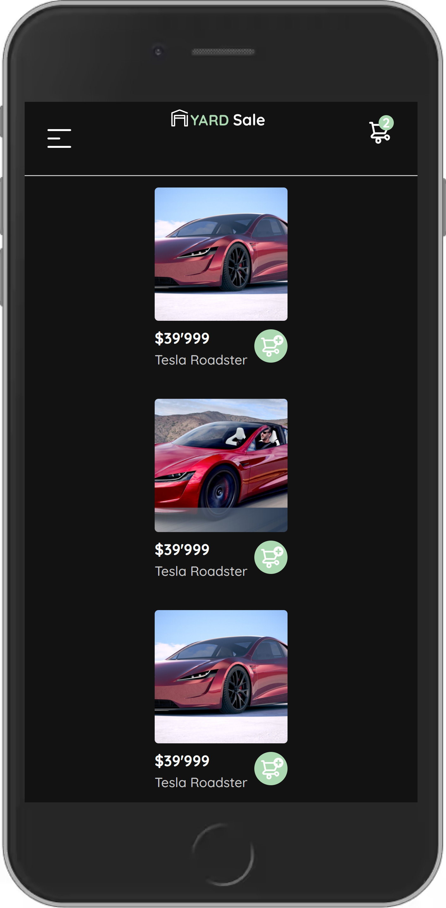

# React Practico con Oscar Barajas Taveras
### Class Notes video3
package.json
```
$ npm init
  "name": "reactpractico",
  "version": "1.0.0",
  "description": "react eshop",
  "main": "src/index.js"
  "keywords": [
    "react",
    "javascript",
    "shop"
  "author": "CheatModes4 rroderickk@gmail.com",
  "license": "MIT",
  
$ npm install react react-dom 
```

### Class Notes video4
Configuración de Webpack y Babel

```
$ npm install @babel/core @babel/preset-env @babel/preset-react
$ npm install webpack webpack-cli webpack-dev-server
$ npm install babel-loader html-loader html-webpack-plugin 

```
### Class Notes video5
Cambios en tiempo real con Webpack

```
webpack.config.js
  mode: 'development',
```
### React con CSS y Sass video6
```
$ npm install mini-css-extract-plugin css-loader style-loader sass sass-loader -D
```
### Transformando HTML y CSS en componentes video7
Componentes

### Estilos en los componentes de React video8
styles scss

### Estilos en los componentes de React video9
React Router DOM
```
<!-- deprecated: $ npm install rect-router-dom -->
$ npm install react-router-dom@6
```
[ReactRouterOvereview](https://reactrouter.com/docs/en/v6/getting-started/overview#configuring-routes)

### Navegación entre rutas video10
### Navegación entre rutas video11
Header en todas las rutas
```
comienza el reto:
- login: check
- forgotPassword: check
- notFound: check
- home: check
- step-1 nav: check
- step-2 sendEmail: check
- step-3 karts: check
- step-4 fix all bugs
```


 

###  ¿Qué es Atomic Design? video12
Siguiendo la modalidad de atomicDesing
```
continuando el reto:
- step-4 Home, Login,ForgotPassword, SendEmail, NotFound, ProductList,ProductDetail,Sumary,My Account,
- step-5 Sumary, Checkout..
- step-6 jsx completed, todo: review responsive components..
```

###  Tipos de componentes en React: stateful vs. stateless video14
ver archivo statefullvsstatement.js

### Imágenes y alias en Webpack
con esto en el archivo webpack leemos imagenes de todo tipo
```
en webpack.js
{
test: /\.(png|jpg|svg|jpeg|web|svg)$/,
type: 'asset/resource',
generator: {
  filename: "public/[hash][ext]",
},
```
con esto acortamos la codificacion y bastantes lineas de texto
```
Aquí dejo algunos alias 😄
alias: {
  '@components': path.resolve(__dirname, 'src/components/'),
  '@containers': path.resolve(__dirname, 'src/containers/'),
  '@pages': path.resolve(__dirname, 'src/pages/'),
  '@styles': path.resolve(__dirname, 'src/styles/'),
  '@icons': path.resolve(__dirname, 'public/icons/'),
  '@logos': path.resolve(__dirname, 'public/logos/'),
}
```
Usando estos decoradores de arroba@:
a la hora de importar una imagen en un archivo jsx con estas configuraciones se hace de esta manera 

```
import imagenName from '@icons/imageName.extension'

```
- step-7 jsx , todo: cambiar el archivo webpack y agregarle las rutas de los decoradores..
- step-7 jsx , todo: cambiar las rutas relativas y usar los decoradores anteriores..

### React.useState video16
cambinando lo anterior y esta clase deberia quedar así todos los jsx
```
import React, { useState } from 'react';
import '@styles/ProductItem.scss';   
import img1 from '@img/img1.jpg';
import addToCard from "@img/bt_add_to_cart.svg";

const ProductItem = () => {
  const [cartName, setCartName] = useState("estadoPorDefecto");
  const handleClick = () => {
    setCartName("nuevoEstado");
  };
return (
<div className="ProductItem">
  
  <div className="productItem-info">
    <div> <p>$price</p> <p>$nameProduct</p> </div>
    <figure >  </figure>
  </div>
</div>
);  };  export default ProductItem;

```

```
step-8

```

### Toggle del menú
step-8
```
Operador Ternario
{toggle ? <Menu /> : ""}  //"" o null
o
{toggle &&  <Menu/>}

```
### useEffect y consumo de APIs
step-9

```
```


